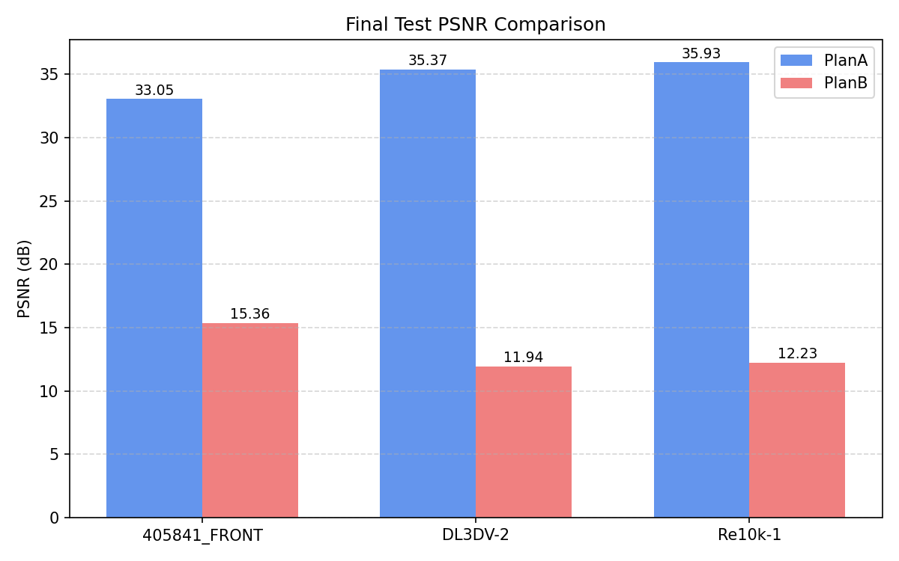
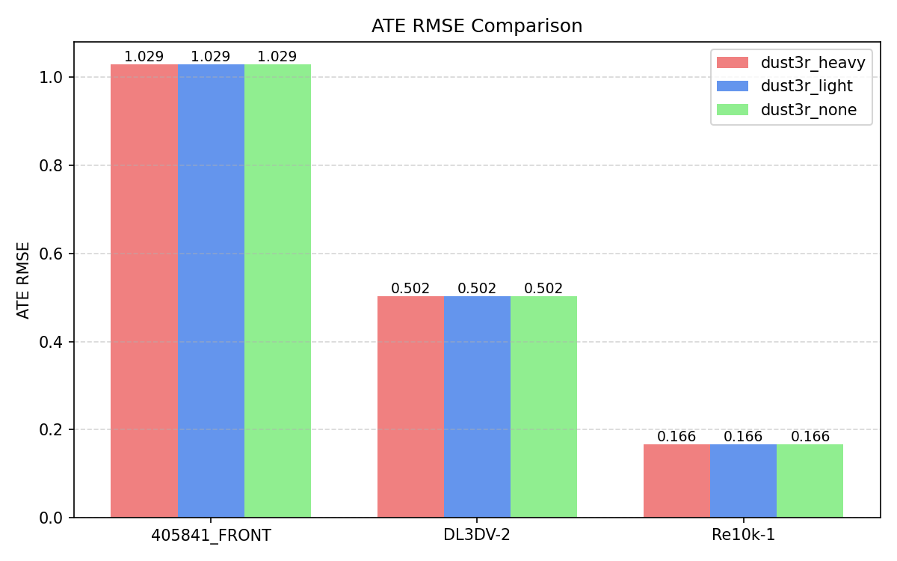
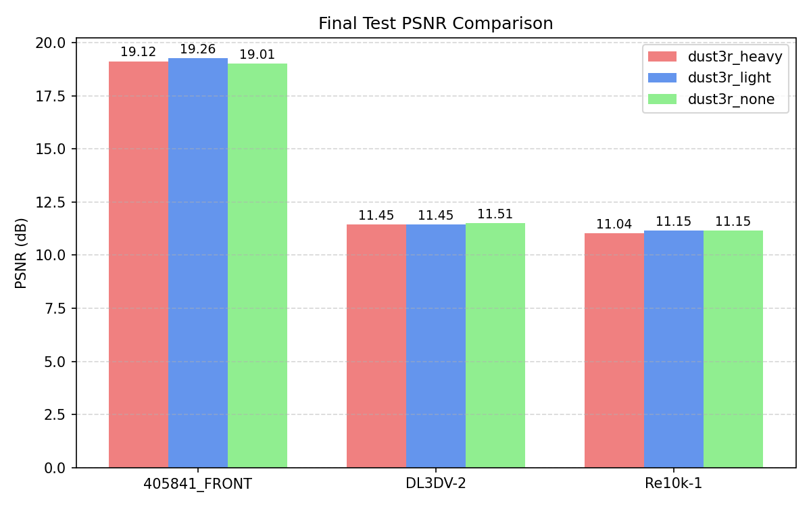
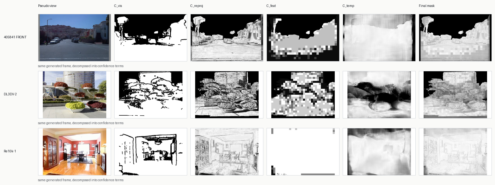
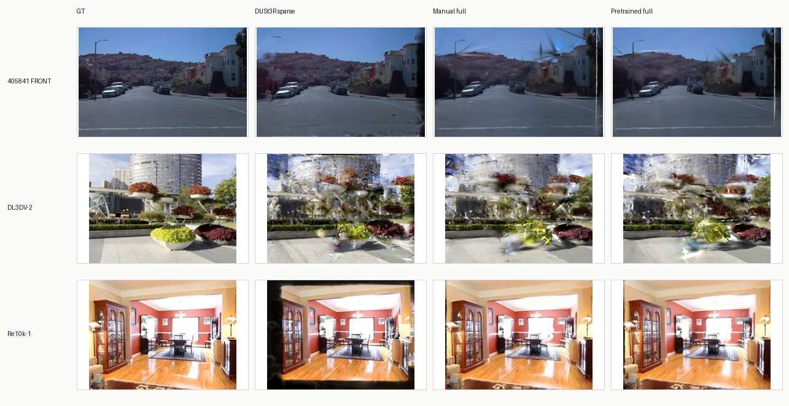

# Generative Sparse-View 3D Reconstruction

Course project codebase for AIAA 3201 Project 4. The repository is organized as
a code-first submission: source code, configs, and scripts are committed;
datasets, checkpoints, report build artifacts, generated pseudo-views,
intermediate COLMAP scenes, and training outputs are intentionally ignored.

## Project Overview

We study sparse-view 3D reconstruction in three stages.

1. **Part 1: Dense posed reconstruction.** Compare COLMAP initialization and
   VGGT initialization for 3D Gaussian Splatting (3DGS).
2. **Part 2: Sparse unposed reconstruction.** Subsample frames, hide poses,
   estimate geometry with DUSt3R, convert predictions to COLMAP/3DGS format,
   and evaluate ATE plus rendering metrics.
3. **Part 3: Generative sparse-view enhancement.** Generate pseudo-views with
   DynamiCrafter, attach interpolated/refined poses, build confidence masks,
   and train 3DGS with masked pseudo-view supervision. The optional pretrained
   route uses MASt3R for feature confidence and SEA-RAFT for temporal
   confidence.

## Repository Layout

```text
.
|-- scripts/                         # Part 1 / 3DGS helper scripts
|-- part3/
|   |-- apps/                        # Part 3 CLI entrypoints
|   |-- configs/                     # Portable Part 3 config templates
|   |-- scripts/                     # Part 3 shell wrappers
|   |-- src/part3_stack/             # Manual confidence pipeline
|   `-- src/part3_stack_pretrained/  # MASt3R + SEA-RAFT confidence route
|-- gaussian-splatting/              # 3DGS codebase used by the project
|-- dust3r/                          # DUSt3R codebase used by the project
|-- vggt/                            # VGGT codebase used by the project
|-- docs/assets/                     # Lightweight README visual results
|-- build_pairs.py
|-- subsample_p2_frames.py
|-- run_dust3r_inference.py
|-- dust3r_to_colmap.py
`-- eval_ate_rmse.py
```

The following directories are local placeholders and are ignored except for
their README files:

```text
data/              # put course datasets here
external/          # clone DynamiCrafter, MASt3R, SEA-RAFT here if needed
pretrained/        # put model checkpoints here
outputs/           # generated COLMAP/DUSt3R/3DGS outputs
part3/workspace/   # generated Part 3 pseudo-views, masks, hybrid scenes
analysis_script_and_results/ # optional local report figures and LaTeX source
```

## Path Customization

Before running the code, check these paths and replace them with your local
locations when needed:

- `data/`: course datasets.
- `outputs/dust3r_to_colmap/`: Part 2 exported sparse scenes consumed by Part 3.
- `part3/configs/*.json`: project root, external repo paths, checkpoint paths,
  and workspace root.
- `pretrained/DynamiCrafter512_interp.ckpt`: DynamiCrafter interpolation
  checkpoint.
- `pretrained/DUSt3R_ViTLarge_BaseDecoder_512_dpt.pth`: DUSt3R checkpoint.
- `pretrained/MASt3R_ViTLarge_BaseDecoder_512_catmlpdpt_metric.pth`: MASt3R
  checkpoint.
- `pretrained/Tartan480x640-M.pth`: SEA-RAFT checkpoint.
- `PART3_WORKSPACE_ROOT=/path/to/your/workspace`: optional override for Part 3
  3DGS outputs on a large disk.

All commands below assume they are launched from the repository root unless a
subdirectory is explicitly shown.

## Model Weights

Large pretrained weights are not committed.  Place or symlink them under
`pretrained/` unless a command explicitly passes another path.  The minimal set
depends on which project part you reproduce:

| Weight | Required for | Expected path / usage | Source |
| --- | --- | --- | --- |
| DUSt3R `DUSt3R_ViTLarge_BaseDecoder_512_dpt.pth` | Part 2 and Part 3 sparse initialization | `pretrained/DUSt3R_ViTLarge_BaseDecoder_512_dpt.pth` | [official DUSt3R repository](https://github.com/naver/dust3r) |
| VGGT model weights | Part 1 Plan B only | downloaded automatically on first inference; optional manual override with `--weights path/to/your/VGGT-1B/model.safetensors` | official VGGT release |
| DynamiCrafter interpolation checkpoint `DynamiCrafter512_interp.ckpt` | Part 3 pseudo-view generation | `pretrained/DynamiCrafter512_interp.ckpt` | [Hugging Face: DynamiCrafter 512 Interp](https://huggingface.co/Doubiiu/DynamiCrafter_512_Interp/blob/main/model.ckpt) |
| MASt3R `MASt3R_ViTLarge_BaseDecoder_512_catmlpdpt_metric.pth` | optional pretrained confidence route | `pretrained/MASt3R_ViTLarge_BaseDecoder_512_catmlpdpt_metric.pth`; code at `external/MASt3R` | [official code](https://github.com/naver/mast3r.git) |
| SEA-RAFT `Tartan480x640-M.pth` | optional pretrained confidence route | `pretrained/Tartan480x640-M.pth`; code at `external/SEA-RAFT` | [official code](https://github.com/princeton-vl/SEA-RAFT.git), [weights](https://drive.google.com/drive/folders/1YLovlvUW94vciWvTyLf-p3uWscbOQRWW) |

3DGS and COLMAP do not require pretrained neural weights in our pipeline: 3DGS
is trained from each reconstructed scene, and COLMAP is a classical SfM/MVS
tool.  Keep the exact filenames above if you want to run the provided configs
without editing paths; otherwise update `part3/configs/*.json` and the command
arguments accordingly.  For example, the DynamiCrafter download is named
`model.ckpt` on Hugging Face; rename it or symlink it to
`pretrained/DynamiCrafter512_interp.ckpt`.

## Environment Setup

The project uses separate environments because 3DGS CUDA extensions,
DUSt3R/VGGT, and DynamiCrafter have different dependency constraints.

<details>
<summary>COLMAP system install</summary>

Install COLMAP so the command `colmap` is available on your `PATH`.

```bash
colmap -h
```

On a cluster, load the provided COLMAP module if available. On a local Linux
machine, follow the official COLMAP installation instructions.

</details>

<details>
<summary>3DGS environment</summary>

```bash
conda env create -f environment-3dgs-cu124.yml
conda activate cvproj-3dgs

cd gaussian-splatting
pip install -e submodules/diff-gaussian-rasterization
pip install -e submodules/simple-knn
pip install -e submodules/fused-ssim
cd ..
```

If your CUDA version differs from CUDA 12.4, adjust the environment file or use
the original `gaussian-splatting/environment.yml`.

</details>

<details>
<summary>DUSt3R environment</summary>

```bash
conda env create -f environment-dust3r.yml
conda activate dust3r
pip install -r dust3r/requirements.txt
```

Place the DUSt3R checkpoint at:

```text
pretrained/DUSt3R_ViTLarge_BaseDecoder_512_dpt.pth
```

Download source: [official DUSt3R repository](https://github.com/naver/dust3r).

</details>

<details>
<summary>VGGT environment</summary>

```bash
conda create -n vggt python=3.10 -y
conda activate vggt
cd vggt
pip install -e .
pip install -r requirements.txt
pip install -r requirements_demo.txt
cd ..
```

VGGT will download its model weights automatically during the first inference
run if no local checkpoint is provided.  If you already have a local copy, pass
it with `--weights path/to/your/VGGT-1B/model.safetensors` in the VGGT command.

</details>

<details>
<summary>DynamiCrafter environment</summary>

Clone DynamiCrafter into `external/DynamiCrafter` and create the environment:

```bash
git clone https://github.com/Doubiiu/DynamiCrafter external/DynamiCrafter
conda env create -f environment-dynamicrafter.yml
conda activate dynamicrafter
pip install -r requirements-dynamicrafter.txt
```

Place the interpolation checkpoint at:

```text
pretrained/DynamiCrafter512_interp.ckpt
```

Download source: [Hugging Face DynamiCrafter 512 Interp](https://huggingface.co/Doubiiu/DynamiCrafter_512_Interp/blob/main/model.ckpt).
The downloaded file is named `model.ckpt`; rename or symlink it to the path
above.

</details>

<details>
<summary>Optional MASt3R + SEA-RAFT route</summary>

The pretrained Part 3 route expects:

```text
external/MASt3R/
external/SEA-RAFT/
pretrained/MASt3R_ViTLarge_BaseDecoder_512_catmlpdpt_metric.pth
pretrained/Tartan480x640-M.pth
```

Download sources:

- MASt3R code and weights: [official MASt3R repository](https://github.com/naver/mast3r.git)
- SEA-RAFT code: [official SEA-RAFT repository](https://github.com/princeton-vl/SEA-RAFT.git)
- SEA-RAFT weights: [official Google Drive folder](https://drive.google.com/drive/folders/1YLovlvUW94vciWvTyLf-p3uWscbOQRWW)

Our pretrained mask route wraps the official MASt3R and SEA-RAFT model modules
for offline confidence-map construction; it does not vendor these repositories
inside this submission.  In our tested setup, the existing `dust3r` environment
can run both pretrained backends, so no separate MASt3R/SEA-RAFT conda
environment is required.  If your machine cannot import either repo from the
current environment, install the missing package dependencies in that same
environment.

If you clone these repositories elsewhere, update:

```text
part3/configs/project_pretrained_conf.json
part3/configs/project_pretrained_full.json
part3/configs/project_pretrained_raw.json
```

</details>

## Data Layout

The real data is not committed. Place it under `data/` or update the command
paths.

```text
data/
|-- 405841/FRONT/
|   |-- rgb/*.png
|   |-- calib/*.txt
|   `-- gt/*.txt
|-- DL3DV-2/
|   |-- rgb/*.png
|   |-- cameras.json
|   `-- intrinsics.json
`-- Re10k-1/
    |-- images/*.png
    |-- cameras.json
    `-- intrinsics.json
```

## Part 1: Dense COLMAP/VGGT + 3DGS

### Plan A: COLMAP initialization

```bash
conda activate cvproj-3dgs

bash scripts/run_colmap.sh re10k sequential 1
bash scripts/inspect_colmap.sh re10k
bash scripts/organize_3dgs_scene.sh Re10k-1 0
```

Repeat with `dl3dv` / `DL3DV-2` and `waymo_front` / `405841_FRONT`.

### Plan B: VGGT initialization

```bash
conda activate vggt
cd vggt
python demo_colmap.py \
  --scene_dir ../outputs/vggt_colmap/Re10k-1 \
  --weights path/to/your/VGGT-1B/model.safetensors
cd ..
```

Move or symlink the resulting COLMAP-style scene to the layout used by the 3DGS
training scripts.

### Train and evaluate 3DGS

```bash
conda activate cvproj-3dgs

bash scripts/train_3dgs.sh Re10k-1 PlanA
bash scripts/eval_3dgs.sh Re10k-1 PlanA

bash scripts/train_3dgs.sh Re10k-1 PlanB
bash scripts/eval_3dgs.sh Re10k-1 PlanB
```

<details>
<summary>Part 1 notes</summary>

- `PlanA` denotes COLMAP initialization.
- `PlanB` denotes VGGT-to-COLMAP initialization.
- Outputs are written under `outputs/3dgs/<Plan>/<Scene>/` by the portable
  scripts.
- Use `CUDA_VISIBLE_DEVICES=<gpu_id>` before a command to select a GPU.

</details>

## Part 2: Sparse Unposed DUSt3R

### Subsample sparse frames

```bash
conda activate dust3r

python subsample_p2_frames.py \
  --data_root data \
  --out_root data_p2_sparse \
  --save_eval_meta
```

### Build DUSt3R pairs

```bash
python build_pairs.py \
  --root data_p2_sparse \
  --scene-graph swin-2 \
  --symmetrize
```

### Run DUSt3R inference

```bash
python run_dust3r_inference.py \
  --root data_p2_sparse \
  --output-root outputs/dust3r/results_dust3r_light \
  --dust3r-repo dust3r \
  --weights pretrained/DUSt3R_ViTLarge_BaseDecoder_512_dpt.pth \
  --scene-graph swin-2 \
  --min-conf-thr 3.0
```

### Evaluate ATE RMSE

```bash
python eval_ate_rmse.py \
  --results-root outputs/dust3r/results_dust3r_light \
  --data-root data_p2_sparse \
  --output outputs/dust3r/ate_rmse_summary.json
```

### Export DUSt3R results to COLMAP/3DGS format

```bash
python dust3r_to_colmap.py \
  --results-root outputs/dust3r/results_dust3r_light \
  --output-root outputs/dust3r_to_colmap/dust3r_light \
  --overwrite
```

### Train and evaluate sparse 3DGS

```bash
conda activate cvproj-3dgs

cd gaussian-splatting
python train.py \
  -s ../outputs/dust3r_to_colmap/dust3r_light/Re10k-1 \
  -m ../outputs/3dgs/dust3r_light/Re10k-1 \
  --eval \
  --test_iterations 1000 3000 7000 15000 30000 \
  --save_iterations 1000 3000 7000 15000 30000

python render.py -m ../outputs/3dgs/dust3r_light/Re10k-1 --skip_train
python metrics.py -m ../outputs/3dgs/dust3r_light/Re10k-1
cd ..
```

## Part 3: Generated Pseudo-Views + Confidence

Part 3 consumes the Part 2 exported scene:

```text
outputs/dust3r_to_colmap/dust3r_light/<scene>
```

The default configs are under `part3/configs/`. They use repo-relative paths
and write generated artifacts to `part3/workspace/`.

### Manual raw/conf/full route

Generate one shared pseudo-view set per scene and derive the three ablation
variants:

```bash
conda activate dust3r

SCENES="405841_FRONT DL3DV-2 Re10k-1" \
  bash part3/scripts/run_reuse_pseudo_ablation.sh
```

This creates hybrid scenes such as:

```text
part3/workspace/hybrid_scenes/Re10k-1_gen_raw
part3/workspace/hybrid_scenes/Re10k-1_gen_conf
part3/workspace/hybrid_scenes/Re10k-1_gen_full
```

### Optional pretrained MASt3R + SEA-RAFT route

```bash
conda activate dust3r

SCENES="405841_FRONT DL3DV-2 Re10k-1" \
  bash part3/scripts/run_reuse_pseudo_pretrained_ablation.sh
```

Make sure the MASt3R/SEA-RAFT repos and checkpoints match the paths in
`part3/configs/project_pretrained_full.json`.  The wrappers import official
code from `external/MASt3R` and `external/SEA-RAFT`; in our environment this
runs inside the same `dust3r` environment used for Part 2/3, without an extra
MASt3R- or SEA-RAFT-specific conda environment.

### Train commands

Use `PART3_WORKSPACE_ROOT` to move outputs to a large disk if needed.

```bash
PART3_WORKSPACE_ROOT=path/to/your/part3/workspace \
CUDA_VISIBLE_DEVICES=0 \
bash part3/scripts/train_part3_3dgs.sh \
  part3/workspace/hybrid_scenes/Re10k-1_gen_conf \
  Re10k-1_gen_conf \
  30000 \
  --confidence_manifest part3/workspace/runs/Re10k-1/Re10k-1_gen_conf/confidence/confidence_manifest.json
```

For `full`, add online confidence:

```bash
PART3_WORKSPACE_ROOT=path/to/your/part3/workspace \
CUDA_VISIBLE_DEVICES=0 \
bash part3/scripts/train_part3_3dgs.sh \
  part3/workspace/hybrid_scenes/Re10k-1_gen_full \
  Re10k-1_gen_full \
  30000 \
  --confidence_manifest part3/workspace/runs/Re10k-1/Re10k-1_gen_full/confidence/confidence_manifest.json \
  --enable_online_confidence
```

### Evaluation commands

```bash
PART3_WORKSPACE_ROOT=path/to/your/part3/workspace \
bash part3/scripts/eval_part3_3dgs.sh \
  path/to/your/part3/workspace/3dgs_outputs/Re10k-1_gen_conf

PART3_WORKSPACE_ROOT=path/to/your/part3/workspace \
bash part3/scripts/eval_part3_3dgs.sh \
  path/to/your/part3/workspace/3dgs_outputs/Re10k-1_gen_full
```

<details>
<summary>Common Part 3 overrides</summary>

```bash
# Run one scene only
SCENE=DL3DV-2 bash part3/scripts/run_reuse_pseudo_ablation.sh

# Rebuild confidence/hybrid variants but reuse generated pseudo frames
REBUILD_VARIANTS=1 bash part3/scripts/run_reuse_pseudo_ablation.sh

# Build only conf/full variants
VARIANTS="conf full" bash part3/scripts/run_reuse_pseudo_ablation.sh

# Select GPU
CUDA_VISIBLE_DEVICES=1 bash part3/scripts/train_part3_3dgs.sh ...

# Move training outputs
PART3_WORKSPACE_ROOT=path/to/your/part3/workspace bash part3/scripts/train_part3_3dgs.sh ...
```

</details>

## Visual Results

The figures below are lightweight copies of the report visualizations.  They
are included directly in the README so the submitted repository shows both
quantitative trends and qualitative Part 3 behavior without requiring the full
report build directory.

### Part 1: Dense Initialization

COLMAP initialization consistently outperforms the current VGGT-to-COLMAP
export path for dense 3DGS training.



### Part 2: Sparse DUSt3R Reconstruction

DUSt3R recovers usable sparse unposed geometry, but rendering quality remains
limited compared with dense COLMAP initialization.





### Part 3: Confidence-Aware Pseudo-Views

The manual route builds masks from coarse visibility, reprojection, feature,
and temporal confidence; the pretrained route replaces feature/temporal
backends with MASt3R and SEA-RAFT while keeping the same 3DGS training
interface.



Generated pseudo-views improve the weakest sparse DUSt3R cases most clearly,
especially Re10k-1.  The pretrained route is competitive, while the manual route
remains slightly stronger at 30k on most scenes.



## Report and Analysis

The report folder is treated as local-only and is not part of the GitHub
submission. If you keep local analysis scripts or LaTeX sources, place them
under `analysis_script_and_results/`; Git will ignore that directory.

```bash
python part3/apps/compare_part3_metrics.py \
  --baseline path/to/your/baseline_model \
  --part3 path/to/your/part3_model \
  --output path/to/your/part3_eval_summary.json
```

## Large Files and Checkpoints

The repository intentionally does not track:

- raw datasets and sparse subsets,
- COLMAP databases and converted scenes,
- DUSt3R outputs,
- 3DGS checkpoints/outputs,
- Part 3 pseudo-views, confidence maps, and hybrid scenes,
- pretrained model weights.

Use `data/`, `pretrained/`, `external/`, `outputs/`, and `part3/workspace/`
locally. These directories are ignored by Git except for their README files.

## Third-Party Licenses

This repository includes project-integrated copies of 3DGS, DUSt3R, and VGGT.
Their original license files are kept in their respective directories.
DynamiCrafter, MASt3R, and SEA-RAFT are optional external repositories and
should be cloned separately under `external/` following their official
licenses.  The pretrained Part 3 route uses MASt3R/SEA-RAFT through lightweight
wrappers around their official code, and our tested environment does not require
creating separate conda environments for those two repositories.
